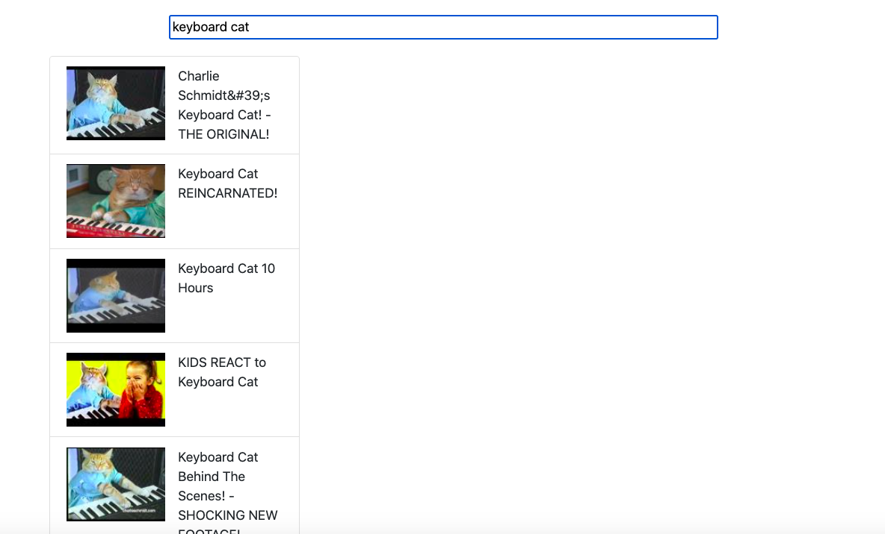

## Overview

This project creates a user interface to browse videos. Built with Vue and the Youtube data API.

I followed this tutorial by Stephen Grider on Udemy: https://www.udemy.com/vue-js-course/

## Running the App

In the `src` directory, create a `config.js` file and add the API key for the YouTube Data API:

```
export default "API KEY GOES HERE";
```

Then run:

```
npm install
npm run serve
```

The app runs on `http://localhost:8081/`.

## Screenshots

The search results on the home page are updated every time you type a character.

### Search Results for Keyboard Cat



### Search Result Detail Page

The detail page for a video lets you play it in the browser, and YouTube's recommended videos are shown in the right column.

If you click a recommended video, you go to the detail page for that video within the Vue app.

